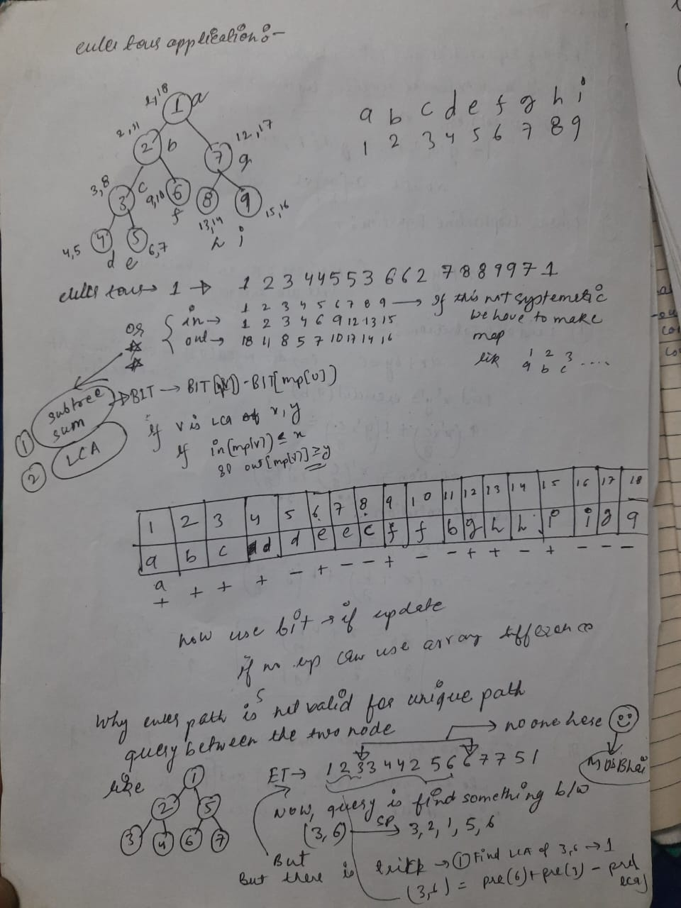

#### Graph:
1. DFS/BFS: ✅ 
2. 0/1 BFS (SP linear): ✅ 
3. Inverse Graph: ✅
   1. https://codeforces.com/problemset/problem/1242/B
   2. You're given an undirected graph of n nodes with n(n-1)/2 total edges (it is complete). You are given m edges, where the length is 1, and the rest of the n(n-1)/2 — m edges are of length 0. Find the Minimum Spanning Tree (MST) of this graph.
   3. It can be shown that our MST will consist of as many edges of 0 that we can add (lets call a collection of nodes with the same length 0 connected to each other a connected component). Therefore, there will be a select number of 1s that we must use to connect these components. It turns out that the number of 1s we need to use is equivalent to the number of connected components in the graph subtracted by 1.
   4. Now, our problem is reduced down to find the number of connected components with the length of 0. Naive DFS or BFS takes O(V + E) time, where V = n and E = n(n-1)/2. It can be shown then, that our current code would be in O(N^2). However, we can make the observation that whenever we visit an element, we don't need to check this element anymore in any of our future traversals. Therefore, we can try to erase this node in every visit. We can simply manage do this with a set.
   5. intuition: if we normally do , to find connected component of zero edges will be n^2 , because each vertex we are checking for all n vertices. What there is any sence in even consider in looping the visited vertex. So maintain a set of all vertice, and only loop on the remaining vectex and which also not have weight 1. 
4. LCA: (Binary lifting)✅
5. SCC: (Kosaraju's algorithm) ✅ 
6. DFS tree: ✅⌛
   1. this is kind of concept or idea or intuition behind the algorithms like bridge finding or some other etc. Since bridge finding algo is kind of unintuitive using two array.
   2. while doing dfs on graph, we visit some edge while some not since the vertex of that edge already visited while visiting neighbouring vertex. 
   3. https://codeforces.com/blog/entry/68138 ( also mentioned some of the other problems which can be solved having this concept inside of it. )
   4. now bridge defined as =>  A span-edge uv is a bridge if and only if there exists no back-edge that connects a descendant of uv with an ancestor of uv . In other words, a span-edge uv is a bridge if and only if there is no back-edge that "passes over" uv and a back-edge is never a bridge.
   5. although after knowing dfs tree , then bridge find with low and idx will also looks intuititve.
7. Articulation Bridges and Bridge Tree: ✅  Tarjan's bridge finding algorithms.
8. Re-rooting technique: ✅⌛
   1. https://codeforces.com/blog/entry/76150
   2. this is trick use to solve the dp on tree problems.
   3. intro: 
``
      Our DP changes if we change the root of the tree, otherwise it won't make any sense to use this trick). Let's say we want to find dp[v] for every vertex in a tree, we must be able to update dp[v] using the children of vertex v . ****Then the trick allows you to move the root from a vertex to one of its adjacent vertices in O(1)****.
`` 
   4. It kind of use to problem for e.g. find maxmium diameter from each vertex. So we find the dp[root] by running dfs, then with the help of this we find the dp for all the other vertices. This is also called in-out dp. [Problem](https://codeforces.com/contest/1187/problem/E). More can be find over here. [Link](https://codeforces.com/blog/entry/20935)  
9. Strong orientation: ✅
   1. A strong orientation of an undirected graph is an assignment of a direction to each edge that makes it a strongly connected graph. That is, after the orientation we should be able to visit any vertex from any vertex by following the directed edges.
   2. this kind of we already solved in dfs tree blog: If graph have bridge not possible, else make span-edges in downward and back-edge in upward. It must be SCC.
   3. https://cp-algorithms.com/graph/strong-orientation.html#toc-tgt-3 ( ⌛ see one extension, find orientation so that SCC minimum )
10. Articulation points: ✅
11. Topological: ✅
12. Prim’s MST: ✅
13. Kruskal’s MST: ✅
14. Dijkstra's Algorithm ( nlogn ):✅ ( can be used for directed or undirected ) 
    1. Limitations:
    2. One source shortest path.
    3. There shouldn't be negative edge in graph. ( though this can be used with negative edge, but while iteration we will have to consider all the vertex even they are visited while relaxing, check algorithm dijkstra imple. )
    4. Intuition: Assume we have lots of ants on source and will go in all direction. Assume that each weight tells how fast the ant will cross this bridge and also it stop only on destination, now once we allow them to move. the ant which will go to the vertex having shortest weight. ( proof: check cp-algorithm)  
    
    5. This is kind of easy once we assume that edge should not be negative, since increase edge will either equal to increase the distance. [Video explanation](https://www.youtube.com/watch?v=MD_KigIdnD8&t=301s&ab_channel=Learner%27sParadise)
15. Bellman Ford ( n^2 ): ✅
    1. Single source shortest path with negative weight edges.
    2. Not works when there is negative weight cycle. ( a cycle whose edges are such that the sum of their weights is a negative value )
    3. 
    4. Intuition: 
    5. Why dijkstra doesn't work for -ve weight ? ( as already mentioned above it does work depending upon implementation. Note it might stuck in loop if we have negative weight cycle)
    6. This is also kind of intuitive, since we are checking relaxation on each, but with condition so it will only visit the vertex first which are near to source, then those are near to first iterations.
    7. Now for some vertex to have minimum distance ( keep dijsktra intuition in mind ), it will require atmost no. of iterations equal to edges in shortest path. In dijkstra we check the shorted path, but there all so it will eventually be updated by minimum one.
16. Floyd Warshall: ✅⌛
    1. All pair shortest path.
    2. Not works when there is negative weight cycle.
    3. Intuition: don't know now
17. Euler tour: ✅⌛
    1. Euler tour tree (ETT) is a method for representing a rooted undirected tree as a number sequence, It can be done in different ways [for e.g](https://codeforces.com/blog/entry/63020).
    2. This try is use to solve some problems on range queries on tree, subtree sum, path sum from root, lca etc.
    3. https://codeforces.com/blog/entry/18369 [tutorial + usecase]. ( there is one problem in algo section related to lca+euler)
    4. 
18. SPFA (Shortest Path Faster Algorithm):✅
    1. https://cp-algorithms.com/graph/bellman_ford.html#shortest-path-faster-algorithm-spfa
    2. Kind of optimisation of bellmon, but its worst is still n*m. This run infinite if any negative weight cycle, so will have to stop algo once get this.
19. Cycle detection: ✅ 
    1. Directed(three colour)/Undirected(visited array only). 
    2. Both mention in this [link]((https://cp-algorithms.com/graph/finding-cycle.html)).
20. 2 SAT:
21. Maximum Clique:
22. Maximum independent set:
23. Eulerian path:
    1. Directed graph:
    2. Undirected:
24. Chromatic number:
25. Counting labeled graphs:
26. Number of Ways to Make a Graph Connected:
27. Prufer Code:
28. Tree Isomorphism:
29. Dinics Algorithm (Max flow):
30. Hopcroft Karp Algorithm:
31. Kuhns Algorithm:
32. Hungarian Algorithm:
33. Chinese Postman Problem:
