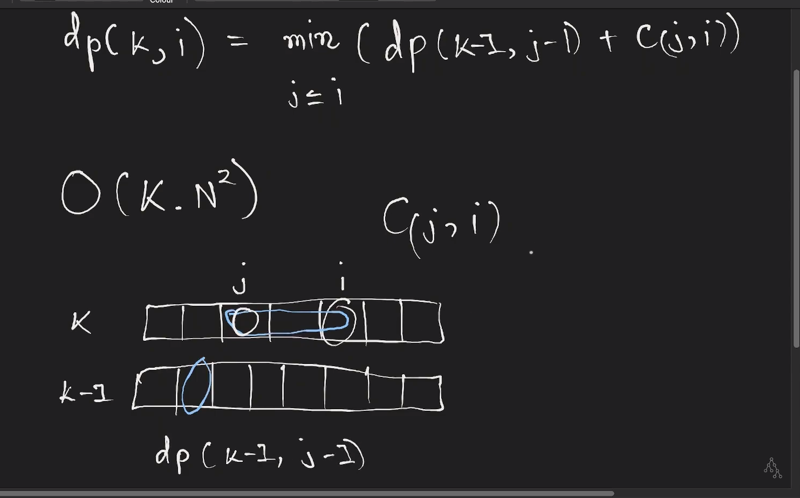

#### Dynamic Programming:
https://codeforces.com/blog/entry/67679

1. Standard 1D: ✅
   1. Kadane algorithm, prefix sum and LIS.
2. Standard 2D: ✅
   1. LCS.
   2. Matrix chain multiplication.
   3. 2D kadane.
   4. Edit distance.
   5. Path in matrix and variations.
   6. Burst balloons.(***still unintuitive*** :(. will have to check it once. )
3. Digit DP.✅
   1. https://codeforces.com/blog/entry/53960
   2. https://leetcode.com/problems/number-of-digit-one/description/
   3. We always have to find about the counts of number , which having some property with digit and like in range of number. We play with digit position, tight flag and some property in digit dp.
4. Divide and conquer optimization? ❌⌛ [video link](https://www.youtube.com/watch?v=Ec3fSWk9JOw&ab_channel=AlgorithmsConquered)
   1. Take example:= Given an array of n elements, your task is to divide into k subarrays. The cost of each subarray is the square of the sum of the values in the subarray. What is the minimum total cost if you act optimally?
   2.  
   3. It change the time complexity of above recurrent and from (n^3) -> (n^2 logn). On basis of something called quadrangle equality. [cp-algorithm](https://cp-algorithms.com/dynamic_programming/divide-and-conquer-dp.html)
5. Knuth Optimization? ❌⌛
   1. Optimisation of O(n^3) -> O(n^2) for some type of recurrence as in above one. [cp-algorithm](https://cp-algorithms.com/dynamic_programming/knuth-optimization.html) 
6. Substring DP: ✅
   1. This is KMP algorithm. Check in string
7. SOS DP: ✅
   1. https://codeforces.com/blog/entry/45223
   2. Sample Problem: find the value f(mask) for each subset of 2^n. for a particular subset f(subset)= the sum of all the subset of which belong to this. (assume array of 2^n have values all one.)
   3. check in directory,  
8. DP over divisor: ❌⌛ (***has to update the note pic***)
   1. TBU ( was something related to divisor )
9. Subset Sum in SQRT. ❌
10. Bitmask DP: ✅
    1. https://codeforces.com/blog/entry/47764
    2. This trick is usually used when one of the variables have very small constraints that can allow exponential solutions. For e.g. TSP.
    3. In this we use bitmask as visited array in dp.
    4. sos vs bitmask => sos is a case of bitmask dp which used to calculate the sum of values over all subsets of a set efficiently.
    5. There are lots of optimisation and variation in this for some specific problems mentioned in blog like below two (x2+1, open and close) etc.
    6. For this scope just check TSP solution.
11. x2 +1 trick:
12. Open and close interval trick:
13. DP on graph:
14. DP on tree:
