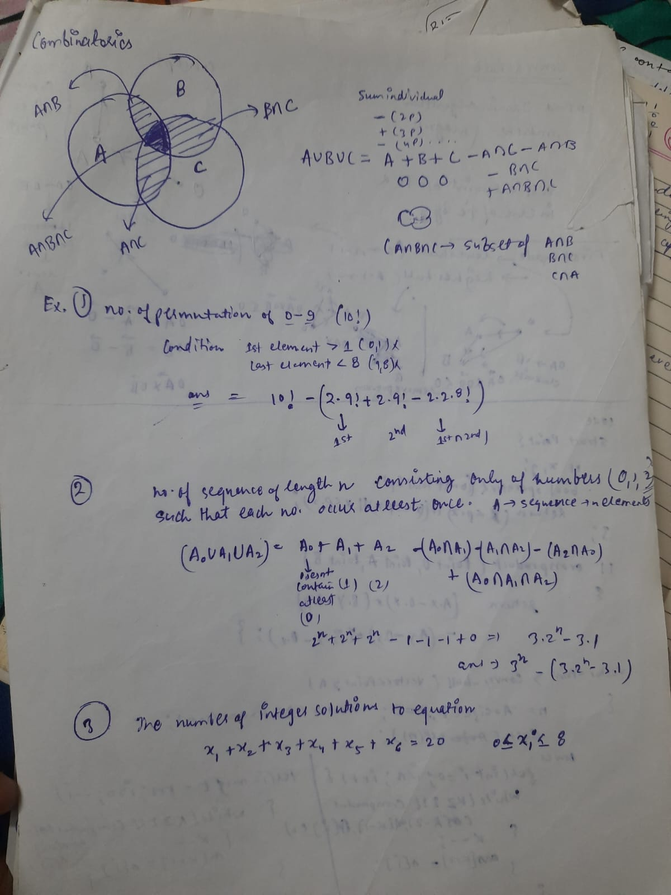
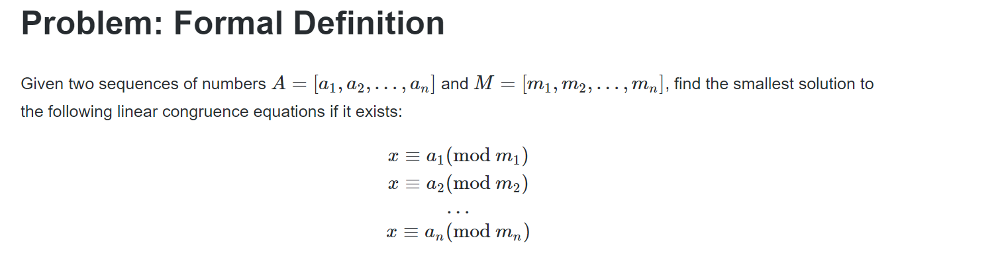

#### Math:
1. Matrix Exponentiation (matrix multiplication) :✅
   1. https://codeforces.com/blog/entry/80195
   2. Suppose you have a matrix A with n rows and n columns (we’ll call such matrices “square matrix of size n”). We can define matrix exponentiation as: Ax = A * A * A * … * A (x times) with special case of x = 0: A0 = In. Its kind of same as number exponentiation. TC: logx*(n^3). Naive -> x*(n^3).
   3. Implementation is exactly same as number once, instead of multiply number we will multiply matrix.
   4. Nth fibonacci number can be find in logn with the help of matrix multiplication.
   5. [Problems](https://codeforces.com/blog/entry/8544)
2. Expected Value: ❌ ([Link](https://dlsun.github.io/probability/counting.html), [Playlist](https://www.youtube.com/playlist?list=PLUl4u3cNGP60hI9ATjSFgLZpbNJ7myAg6)) 
   1. has to be deep dived in this. Always fail to solve problems related to this
   2. https://codeforces.com/blog/entry/62690
3. Binary Exponentiation: ✅
   1. finding power of value in log(n) 
4. Sieve:✅
   1. Find number up n, is prime or not in O(nloglogn)
   2. https://cp-algorithms.com/algebra/sieve-of-eratosthenes.html
   3. There is segmented sieve to find prime between large numbers:❌
   4. There is linear solution also:❌
5. Euclid:✅
   1. Algorithm to find the gcd of two number in log(min(a,b)) time. [numbertheory.cpp]
   2. https://cp-algorithms.com/algebra/euclid-algorithm.html
6. Extended Euclid:✅ [cp-algorithm](https://cp-algorithms.com/algebra/extended-euclid-algorithm.html)
   1. Euclid only talk about the gcd of two number, but this finds a way to represent GCD in terms of a and b, i.e. coefficients x and y for which:  a.x + b.y = gcd(a,b); [numbertheory.cpp]
   2. Linear-diophantine is more general form of this concept
   3. According benzout's identity , always possible to get. :❌ 
7. Combinatorics basics:❌✅ [cp-algorithm](https://cp-algorithms.com/combinatorics/binomial-coefficients.html)
   1. 
   2. TBU , as per frequency of problems.
8. Lucas theorem:❌
9. Phi function: ❌
10. Mobius function: ❌
11. CRT: ✅❌ [blog 2](https://forthright48.com/chinese-remainder-theorem-part-2-non-coprime-moduli/) . [blog 1](https://forthright48.com/chinese-remainder-theorem-part-1-coprime-moduli/)
    1. [cf-blog](https://codeforces.com/blog/entry/61290)
    2. check in algorithm
    3. 
    4. It has 2 form one is weak: when all m are pairwise coprime. second is general.
    5. will check once hit the problem.
12. Modular Multiplicative Inverse:✅
    1. it's an integer x , such that a.x is congruent to 1 modular some modulus m. i.e => a.x congurent 1 mod m. ( Means a.x % m == 1)
    2. This only exist iff , gcd(a,m)=1.
    3. Mostly this used when m is prime. 
    4. a^(m-2) = a^-1 % m. Means we need to find modulus of 1/a , then we can find power(a,m-2) with modules.
    5. 0 is invertible , so take care of this. Means a!=0.  Some time this occur while doing module inverse one by one. like 1/(1/(1/x))%mod. There might possible that child resultant into zero. [Sample](https://codeforces.com/contest/543/problem/D)
      
13. Linear Congruence Equation: ❌
14. Linear Diophantine Equation with Two Variables:✅ [cp-algorithm](https://cp-algorithms.com/algebra/linear-diophantine-equation.html)
    1. a.x+b.y=c  , form of equation. , where a,b and c are given integers. But x and y are unknown.
    2. There are different problems based on this ,like one solution, many solution, in interval . All mention in cp-algorithm. Check as per requirements.
    3. Note: it has solution , iff c is multiple of gcd(a,b);
15. Linear Sieve for Multiplicative Functions:✅
    1. [for detailed blog](https://codeforces.com/blog/entry/54090)
    2. check snippet.
    3. in the previous seive we were hitting composite with each prime factor. right now we will hit composite no. only one time by their smallest prime factor.
16. Number of Solutions to a Basic Linear Algebraic Equation: ❌
    1. [cf blog](https://codeforces.com/blog/entry/54111)
17. Intersection of Arithmetic Progressions: ❌
18. 

#### Logics / Trick
1. LCM of array is or can be visualize as the product of maximum exponent of prime factors of each numbers.  [ 2*3, 2^2 * 3^2, 2^3*3^5] => lcm = 2^3 * 3^5
