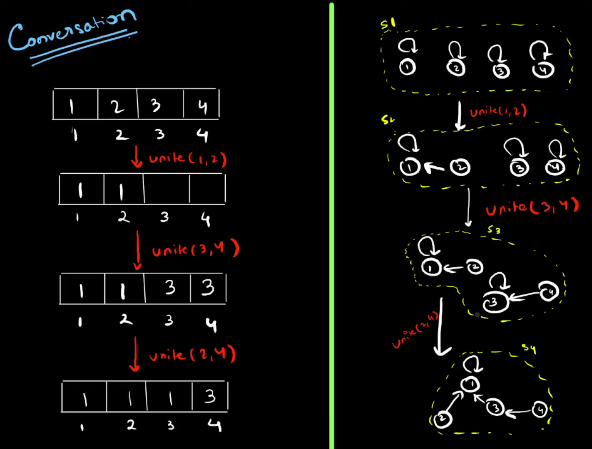
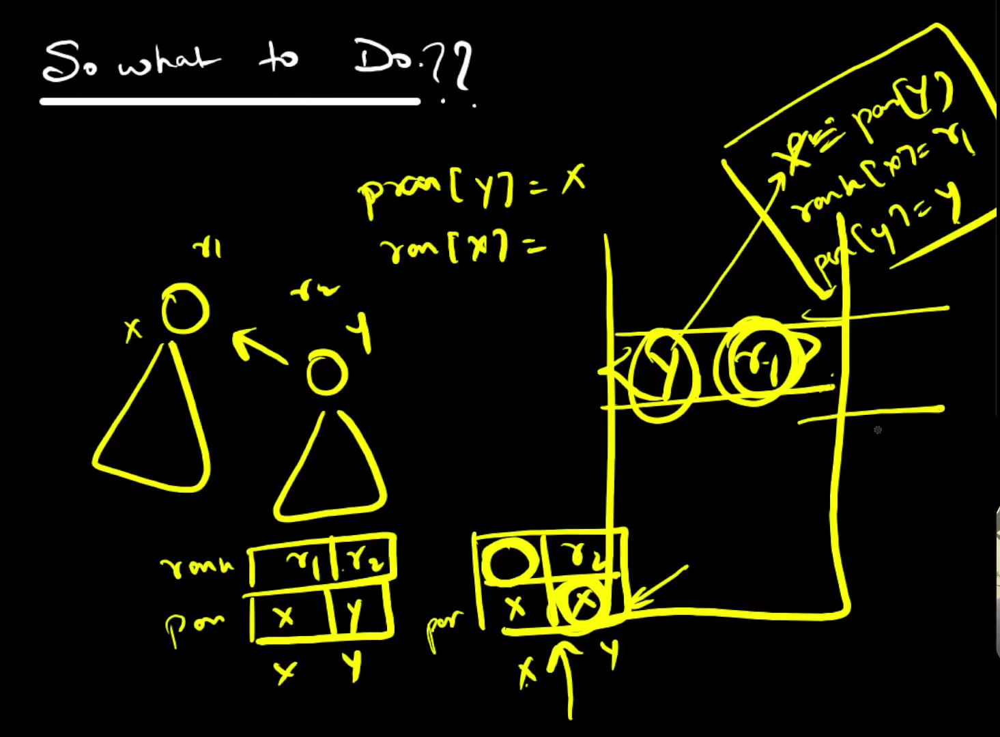
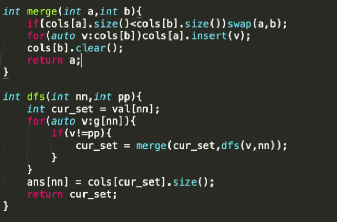

#### Data Structure:
1. Linked-list, stack, queue, heap, BST, BT etc. :✅ 
2. Segment tree:✅
    1. + lazy:✅
    2. Persistent Segment Tree: ❌
    3. Dynamic Segment Tree: ❌
    4. Iterative Segment Tree: ❌
    5. Segment Tree ft Arithmetic Progressions: ❌
3. Merge sort tree: ❌
4. Wavelet tree: ❌
5. Sparse table:❌
   1. https://cp-algorithms.com/data_structures/sparse-table.html
6. BIT:✅ 
    1. Lower bound on BIT
7. MOs Algorithm:✅
8. DSU: [playlist for all ](https://www.youtube.com/playlist?list=PLqf9emQRQrnIQ3DkkyBNGe1s4l3HqMqrz)✅ ( Union and find in constant time. )
    1. Weighted Union find DSU: 
       1. [Problem](https://www.spoj.com/problems/CHAIN/)
       2. Its kind of do the dsu operations , but there is weight on edge and also depend on direction of edge.
       3. Path compression and union by ranking are same here, only the extra part is dealing with weight and find weigh of edge.
    2. DSU with Rollbacks: ✅
       1. Concept is simple we want to rollback to previous state of dsu.
       2. 
       3. We can save a operation in stack of parent array, but that won't work in path compression since we update a lots of parent in one go.
       4. So solution is simply use only union by find ( that have complexity logn in find and merge ).
       5. Now we will store the information about the rank and parent array in stack in each version.
       6. will store the index which has changes, and previous rank of current parrent of that index.
       7. 
    3. ( Sack ) DSU on the tree ( small to large ): ✅ ( n(log(n))^2)
       1. On high level concept is we have some value on left subtree and in right subtree, we will find for the parent by merging them, then will be like (n^2) , but dsu on tree reduce it to nlogn.( in vivek tutorial, it shown merging by union (or small-to-large merging ) like in dsu so its (logn)^2 for finding the unique colours in subtree.)
       2. 
       3. [Tutorial 1](https://codeforces.com/blog/entry/67696) , [Tutorial 2](https://codeforces.com/blog/entry/44351), [Tutorial 3, vivek](https://codeforces.com/blog/entry/103064)
       4. check in advanced-ds-algo (it's same as above ss)   
9. SQRT Decomposition: ✅
10. Centroid Decomposition: ❌
11. Binarizing a Tree:❌
12. Ordered set policy-based DS:✅ (snippet)
    1. set , but can get the order of number and number by its order
13. Venice Technique: ✅
    1. https://codeforces.com/blog/entry/58316 . Since operation , which is tough is updateAll, for this we can maintain the water level variable. Blog have good analogy like having buildings we have to remove x floors from all building, then just increase the water level they will all vanish.
    2. ```js
       struct VeniceSet { 
          void add(int);
          void remove(int);
          void updateAll(int); // do the update for all elements
          int getMin(); 
          int size();
       }
      ```
15. Persistent Array: ❌
