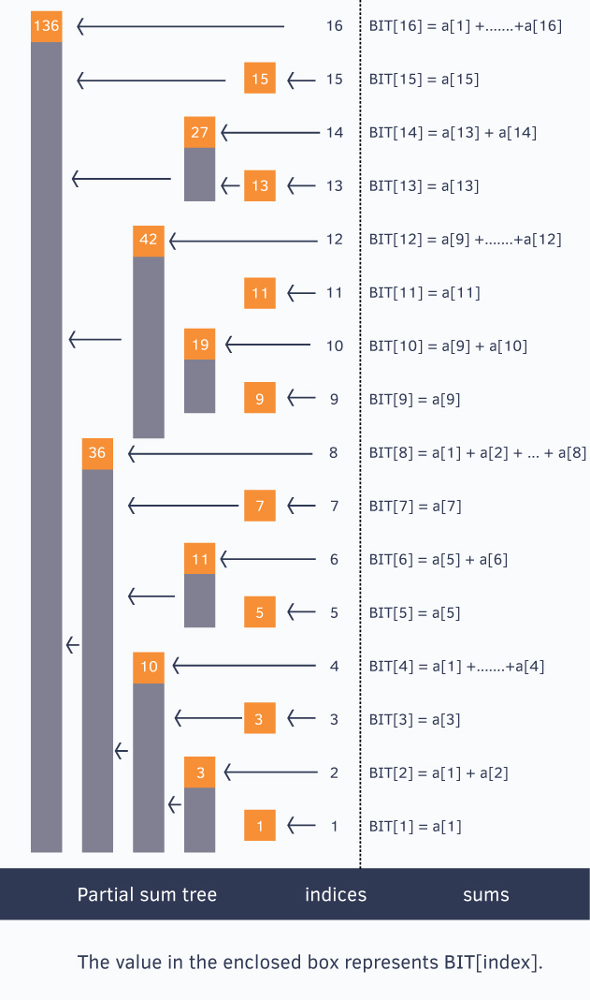

#### Range Query:
1. BIT: ✅
   1. Dynamic prefix sum array, (prefix sum with update)
   2. https://www.hackerearth.com/practice/notes/binary-indexed-tree-or-fenwick-tree/
   3. x&(-x) gives the last set bit in a number x.
   4. Suppose it we want to update at index 13 -> then we will have to update at 13,14 and 16 as well. (+ (x&-x))
   5. Same at time of getting sum, it will fetch from 14,12,8,0. (-(x&-x));
   6. 
   7. Intuition [Link](https://cs.stackexchange.com/questions/10538/bit-what-is-the-intuition-behind-a-binary-indexed-tree-and-how-was-it-thought-a): In short we somehow change array in tree with saying that each node with store not all but some array values. And by going in some fix pattern, we can find prefix sum in tree height time i.e. log(n) , same for update can find pattern which will take also log(n). Then convert these node to binaries, then got that above trick to implement it properly. 
2. Segment tree: ✅ in part 5
3. SQRT Decomposition [Link point update](https://www.geeksforgeeks.org/square-root-sqrt-decomposition-algorithm/), [cp-algorithm](https://cp-algorithms.com/data_structures/sqrt_decomposition.html): ✅
   1. check in algo-> advanced-ds-algo. Change complexity by square root of n.
   2. break the array in boxes of size sqrt(n).
   3. precompute the result of those boxes.
   4. Online query: 
   5. Get -> loop on first and last box and middles once result can get in constant time instead of sqrt(n).
   6. Update -> [Not sure about range], but if we are updating the particular index that is fine.
   7. Advance blog: https://codeforces.com/blog/entry/83248
4. Mo’s [cp-algorithm](https://cp-algorithms.com/data_structures/sqrt_decomposition.html): ✅ 
   1. check in algo-> advanced-ds-algo
   2.  
5. Euler tour → these algo :✅